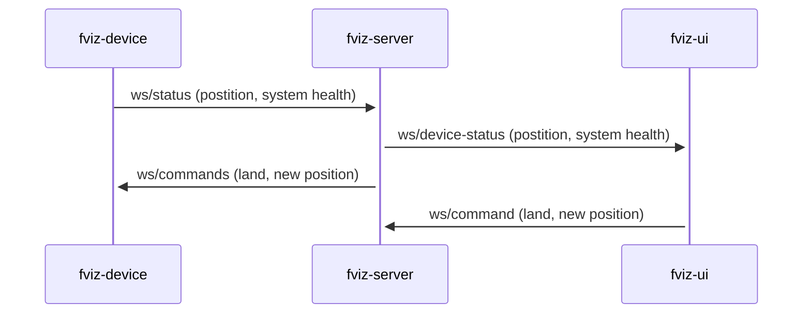
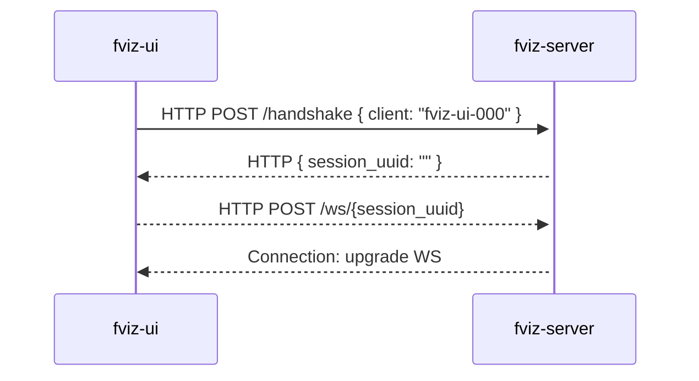

# fviz

Simple drone flight visualization.

## Getting Started

### Requirements

- Cargo, Rust
- NodeJS
- Yarn
- Docker

Build a package

```bash
make build package=<server|ui>
```

Run a package

```bash
make run package=<server|ui>
```

Test a package

```bash
make test package=<server|ui>
```

### Folder structure

- `docs/`: text and image assets for documentation
- `packages/`:
  - `fviz-server/`: `rust` web server
  - `fviz-ui`/: `react` client app

## System communication




## Client handshake/registration




## TODO

- [x] Setup Rust CI
- [x] Setup React CI
- [x] SetReact Yarn 2
- [ ] Setup ESLint
- [ ] Setup Stylelint
- [ ] Create Releases
- [ ] Build docker images
- [ ] Setup deployments
- [ ] Setup renovate bot
- [ ] Setup commit lint
- [ ] Setup PR check (size, title, etc)
- [ ] Add logs to server
- [ ] Define Swagger documentation
- [ ] Load configuration in memory
- [ ] Setup server graceful shutdown
