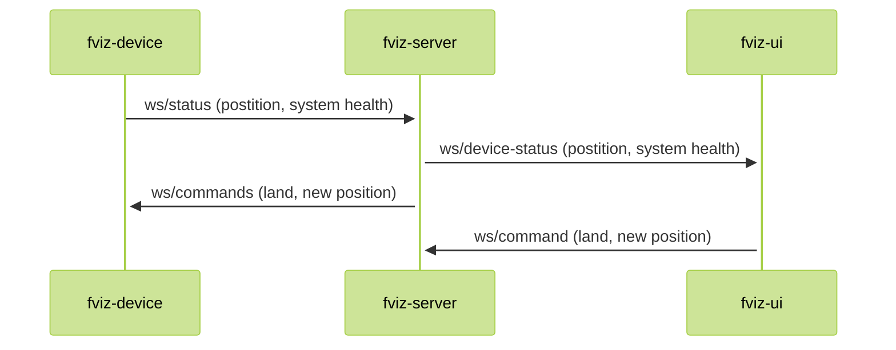

# fviz

Simple drone flight visualization.

## Getting Started

### Requirements

- Cargo, Rust
- NodeJS
- Yarn
- Docker

Build a package

```bash
make build package=<server|ui>
```

Run a package

```bash
make run package=<server|ui>
```

Test a package

```bash
make test package=<server|ui>
```

### Folder structure

- `packages`:
  - `fviz-server`: `rust` web server
  - `fviz-ui`: `react` client app

## System communication



## TODO

- [x] Set up Rust CI
- [x] Set up React CI
- [x] Set React Yarn 2
- [ ] Set up ESLint
- [ ] Set up Stylelint
- [ ] Create Releases
- [ ] Build docker images
- [ ] Setup deployments
- [ ] Set up renovate bot
- [ ] Set up commit lint
- [ ] Set up PR check (size, title, etc)
