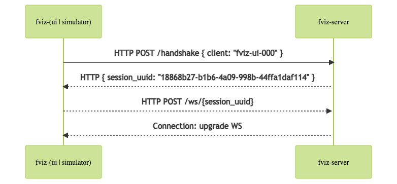

# fviz

<p align="left">
    <a href="https://github.com/protiumx/fviz/actions/workflows/fviz-ui.yml" alt="fviz-ui">
        
    </a>
    <a href="https://github.com/protiumx/fviz/actions/workflows/fviz-server.yml" alt="fviz-ui">
        
    </a>
    <a href="https://github.com/protiumx/fviz/actions/workflows/fviz-simulator.yml" alt="fviz-ui">
        
    </a>
</p>

Simple drone flight visualization monorepo.

> Note: ideally we should split apps into repositories but for demo purposes this will be a monorepo containing `rust` and `react` apps.

## Getting Started

### Requirements

- Cargo, Rust
- NodeJS
- Yarn
- Docker

Build a package

```bash
make build package=<server|ui|simulator>
```

Run a package

```bash
make run package=<server|ui|simulator>
```

Test a package

```bash
make test package=<server|ui|simulator>
```

### Folder structure

- `docs/`: text and image assets for documentation
- `packages/`:
  - `fviz-server/`: `rust` web server
  - `fviz-ui/`: `react` client app
  - `fviz-simulator/`: `go` project to simulate devices/actors

## System communication


### Format of WS messages

Each status update from a device/actor should be formatted as follow
```
<command> // note the line break
<lat> <lng> <alt>
```

## Client handshake/registration




## Server

We relay on [warp](https://github.com/seanmonstar/warp) to handle http and ws requests.
[tokio](https://github.com/tokio-rs/tokio) is being used for multithreading.

## Conventional commits

In this repository commits messages are formatted following [conventional commits](https://www.conventionalcommits.org/en/v1.0.0/).
You will need a linter running locally.

```bash
npm i -g @commitlint/cli @commitlint/config-conventional
```

To set git hooks for commit linting messages run 
```bash
make init-git
```

## TODO

- [x] Setup Rust CI
- [x] Setup React CI
- [x] SetReact Yarn 2
- [ ] Setup ESLint
- [ ] Setup Stylelint
- [ ] Build docker images
- [ ] Setup deployments
- [ ] Setup renovate bot
- [ ] Setup commit lint (ci or local)
- [ ] Setup PR check (size, title, etc)
- [ ] Add logs to server
- [ ] Set Swagger documentation from warp handlers
- [ ] Load configuration in memory
- [ ] Setup server graceful shutdown
- [ ] Setup postgres with docker compose
- [ ] Setup rate limit and payload size
